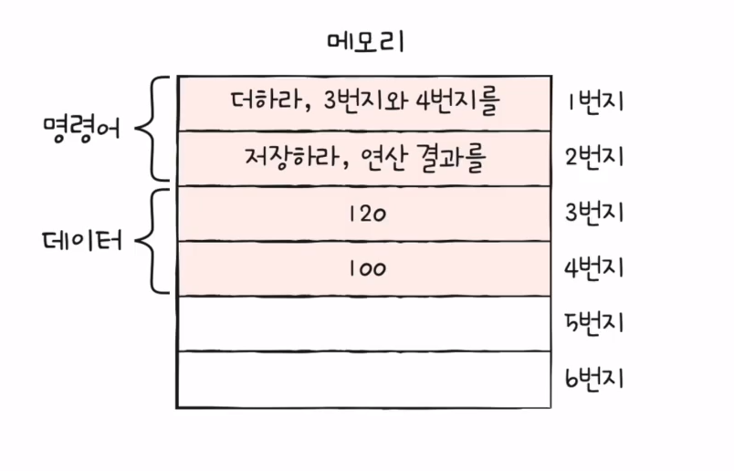
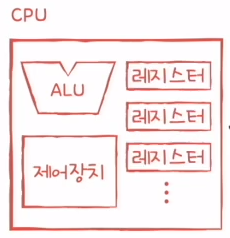
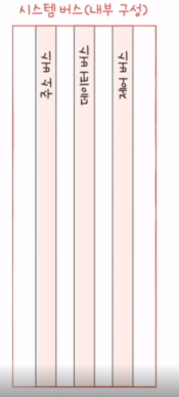

# 컴퓨터 구조

## 컴퓨터 구조의 큰 그림

### 컴퓨터가 이해하는 정보
1. 데이터
    - 숫자와 문자, 이미지 등의 `정적인 정보`
    - 컴퓨터와 주고받거나 내부의 정보를 통틀어 `데이터`라고 칭한다.
    - 0과 1로 숫자를 표현하는 방법
    - 0과 1로 문자를 표현하는 방법

2. 명령어
    - 컴퓨터는 `명령어를 처리하는 기계` 로 칭할 수도 있다.
    - 컴퓨터를 `실질적`으로 움직이게 하는 정보이다.
    - 데이터는 명령어를 위한 일종의 재료라고 봐도 무방하다

### 컴퓨터의 4가지 핵심 부품
1. 메모리
    - 메모리에 저장된 값으로 `주소의 위치`를 알 수 있다.
    - 프로그램이 `실행`되기 위해서는 `메모리에 저장`되어야한다.
    - 현재 실행되고 있는 프로그램(`프로세스`)의 명령어와 데이터를 저장하는 부품이다.
    - 메모리 주소
        - 접근하고자 하는 데이터/명령어의 저장 위치를 알 수 있다.
        - 
2. CPU
    - 메모리에 저장된 명령어를 읽어들이고, `해석`하고 `실행`하는 부품
    - 내부 구성
    - 
      1. ALU(산술논리연산장치) : `계산기`
      2. 레지스터 : CPU 내부의 작은 저장 장치(`임시저장장치`)
      3. 제어장치 : `제어신호`를 보내고, `명령어를 해석`하는 장치
      * 제어신호 : 컴퓨터 부품들을 관리하고 작동시키기 위한 전기신호
        * (ex) CPU에서 메모리에 저장된 값을 읽고 싶을 때는 `메모리 읽기 신호` 를 보낸다.
        * (ex) CPU가 메모리에 값을 저장하고 싶을 때는 `메모리 쓰기 신호` 를 보낸다.

3. 보조기억장치
    - `전원이 꺼져도 보관`될 프로그램을 저장하는 부품
      * 메모리와 차이점 : `메모리`는 `실행할 프로그램`을 저장, `보조기억장치`는 `보관할 정보`를 저장

4. 입출력장치
    - 컴퓨터 외부에 연결되어 컴퓨터 내부와 정보를 교환할 수 있는 부품
    - (ex) 마이크, 키보드, 마우스 등등

### 컴퓨터의 4가지 핵심 부품의 조력자
1. 메인보드(마더보드)
   - 4가지의 부품을 연결할 수 있는 판(보드)이다.
2. 버스
   - 메인보드에 연결된 부품은 `버스`를 통해 정보를 주고 받는다.
   - `버스`는 컴퓨터의 부품끼리 서로 주고 받는 일종의 통로의 개념이다.
   - 컴퓨터의 핵심 부품을 연결하는 버스를 `시스템 버스`라고 부른다.
3. 시스템 버스
   - 
      - `주소 버스` : 주소를 주고 받는 통로
      - `데이터 버스` : 명령어와 데이터를 주고 받는 통로
      - `제어 버스` : 제어 신호를 주고 받는 통로